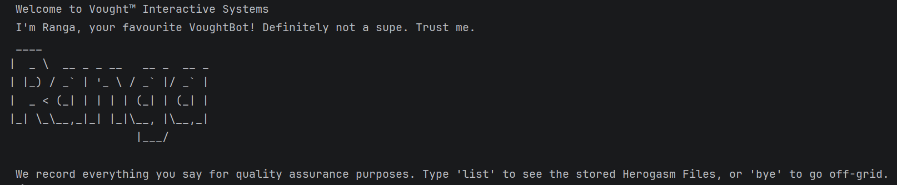

# Ranga — Your VoughtBot Task Manager

> *"We record everything you say for quality assurance purposes."*

Ranga is a fast, no-nonsense command-line chatbot that helps you track your tasks. Type a command, get things done.

Ranga CLI
---

## Quick Start

1. Ensure you have **Java 17 or later** installed.
2. Download the latest `ranga.jar` from the releases page.
3. Run the app from your terminal:
   ```
   java -jar ranga.jar
   ```
4. Type a command and press Enter. Type `bye` to exit.

Your tasks are saved automatically to `./data/ranga.txt` and reloaded each time you start the app.

---

## Commands Summary

| Command          | Format                                                        |
|------------------|---------------------------------------------------------------|
| Add todo         | `todo DESCRIPTION`                                            |
| Add deadline     | `deadline DESCRIPTION /by yyyy-MM-dd HHmm`                    |
| Add event        | `event DESCRIPTION /from yyyy-MM-dd HHmm /to yyyy-MM-dd HHmm` |
| List all tasks   | `list`                                                        |
| Mark as done     | `mark INDEX`                                                  |
| Mark as not done | `unmark INDEX`                                                |
| Delete a task    | `delete INDEX`                                                |
| Find tasks       | `find KEYWORD`                                                |
| Exit             | `bye`                                                         |

---

## Features

### Add a Todo
A basic task with no date attached.

**Format:** `todo DESCRIPTION`

**Example:**
```
todo read book
____________________________________________________________
 Right then. Added to the hit list:
   [T][ ] read book
 Now you have 1 tasks in the list. Have fun!
____________________________________________________________
```

---

### Add a Deadline
A task that must be done by a specific date and time.

**Format:** `deadline DESCRIPTION /by yyyy-MM-dd HHmm`

**Example:**
```
deadline return book /by 2019-12-02 1800
____________________________________________________________
 Right then. Added to the hit list:
   [D][ ] return book (by: Dec 02 2019, 6:00PM)
 Now you have 2 tasks in the list. Have fun!
____________________________________________________________
```

---

### Add an Event
A task that spans a start and end date/time.

**Format:** `event DESCRIPTION /from yyyy-MM-dd HHmm /to yyyy-MM-dd HHmm`

**Example:**
```
event project meeting /from 2019-12-02 1400 /to 2019-12-02 1600
____________________________________________________________
 Right then. Added to the hit list:
   [E][ ] project meeting (from: Dec 02 2019, 2:00PM to: Dec 02 2019, 4:00PM)
 Now you have 3 tasks in the list. Have fun!
____________________________________________________________
```

---

### List All Tasks
Displays all tasks with their type, status, and details.

**Format:** `list`

```
list
____________________________________________________________
 We ain't runnin' a charity. Get to it.
 1.[T][X] read book
 2.[D][ ] return book (by: Dec 02 2019, 6:00PM)
 3.[E][ ] project meeting (from: Dec 02 2019, 2:00PM to: Dec 02 2019, 4:00PM)
____________________________________________________________
```

Task types: `[T]` = Todo, `[D]` = Deadline, `[E]` = Event  
Status: `[X]` = done, `[ ]` = not done

---

### Mark a Task as Done
**Format:** `mark INDEX`

**Example:**
```
mark 2
 Nice! Homelander would be proud.
   [D][X] return book (by: Dec 02 2019, 6:00PM)
```

---

### Mark a Task as Not Done
**Format:** `unmark INDEX`

**Example:**
```
unmark 2
 One more mistake and you'll be sent to Ashley for performance review.
   [D][ ] return book (by: Dec 02 2019, 6:00PM)
```

---

### Delete a Task
Removes a task permanently from the list.

**Format:** `delete INDEX`

**Example:**
```
delete 2
____________________________________________________________
 Gotcha. I've eliminated this task:
   [D][ ] return book (by: Dec 02 2019, 6:00PM)
 Now you have 2 tasks in the list.
____________________________________________________________
```

---

### Find Tasks by Keyword
Searches task descriptions for a matching keyword (case-insensitive).

**Format:** `find KEYWORD`

**Example:**
```
find book
____________________________________________________________
 Here are the matching tasks in your list:
 1.[T][X] read book
 2.[D][ ] return book (by: Dec 02 2019, 6:00PM)
____________________________________________________________
```

---

### Exit
**Format:** `bye`

```
bye
 Thank you for your commitment to keeping supes safe. Try not to cause an international incident!
```

---

## Data Storage

Tasks are saved automatically to `./data/ranga.txt` after every change. The file is created for you if it doesn't exist. If the file contains corrupted data, affected lines are skipped with a warning and the rest of your tasks load normally.